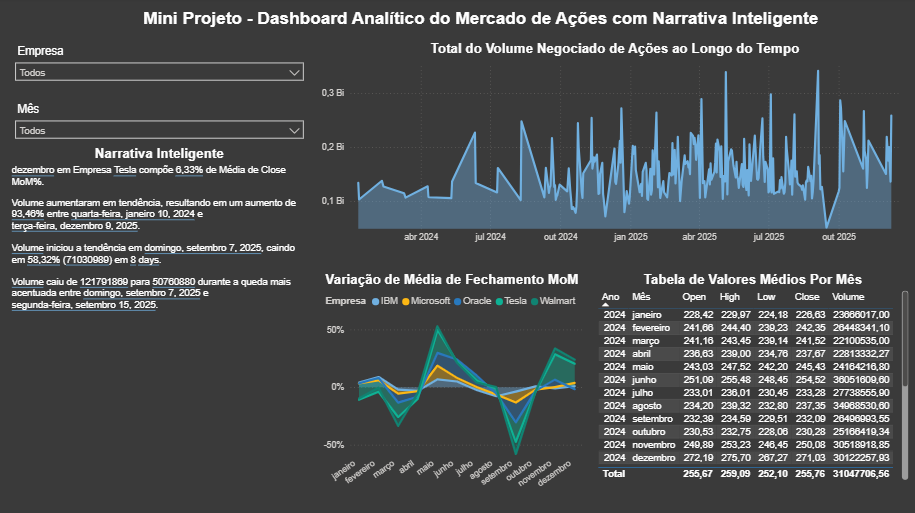
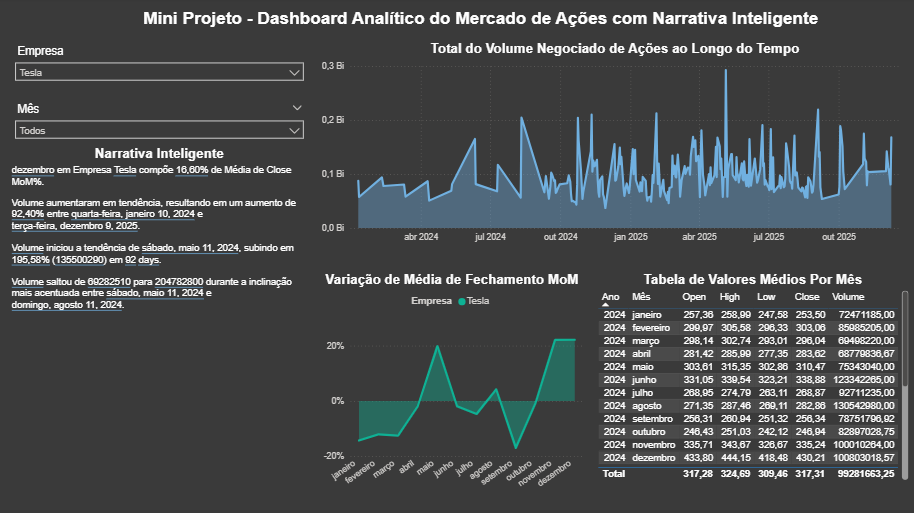
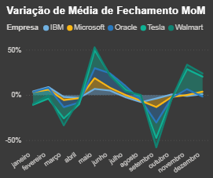
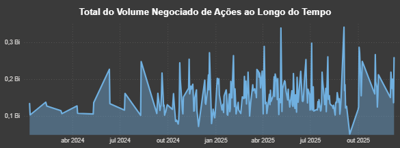
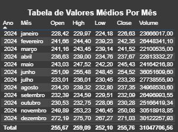
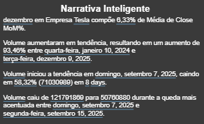

# dashboard-analitico-mercado-acoes
Mini projeto em Power BI: análise de volume e preços de ações com visualizações interativas e Narrativa Inteligente
---

## 🎯 Objetivo do Projeto

Este projeto visa analisar dados históricos de ações de cinco empresas (IBM, Microsoft, Oracle, Tesla e Walmart) para identificar padrões e tendências no mercado financeiro. O dashboard responde perguntas de negócio relevantes e fornece insights automáticos utilizando a funcionalidade de Narrativa Inteligente do Power BI.

---

## ❓ Perguntas de Negócio Respondidas

1. Qual o total de volume negociado de ações ao longo do tempo para as 5 empresas analisadas? (Individual ou combinado)  
2. Qual o valor médio de abertura (Open), mais alto (High), mais baixo (Low) e de fechamento (Close) das ações para todos os meses do período analisado? (Individual ou combinado)  
3. Qual a variação da média do valor de fechamento das ações ao longo do tempo, mês a mês?  
4. Quais são as principais características e tendências nos dados, conforme identificado pela Narrativa Inteligente do Power BI?

---

## 🛠 Tecnologias Utilizadas

- **Power BI Desktop**  
- **Linguagem M (Power Query)** para ETL e preparação de dados
- **DAX** para cálculos e métricas  
- Dados extraídos do portal da Nasdaq: [https://www.nasdaq.com](https://www.nasdaq.com)

---

## 📸 Prints do Dashboard

  
  
  

---

## 📈 Principais KPIs / Métricas

- Volume total negociado por empresa e por período  
- Preço médio de abertura, máximo, mínimo e fechamento por mês  
- Variação do preço médio de fechamento ao longo do tempo  
- Insights automáticos gerados pela Narrativa Inteligente do Power BI

---

## 🚀 Como Explorar o Dashboard

1. Faça o download do arquivo:
[Dashboard Power BI (.pbix) - Clique para Baixar]([files/dashboard-analitico-mercado-acoes.pbix](https://github.com/lidsonmendes/dashboard-analitico-mercado-acoes/raw/refs/heads/main/files/dashboard-analitico-mercado-acoes.pbix))  
2. **Baixe a base de dados:**
[Base de Dados (.xlsx) - Clique para Baixar]([files/StockMarketNew.xlsx](https://github.com/lidsonmendes/dashboard-analitico-mercado-acoes/raw/refs/heads/main/files/StockMarketNew.xlsx))
3. Abra o arquivo `.pbix` no **Power BI Desktop**.
4. Navegue pelas diferentes páginas do relatório para explorar as análises e insights interativos.  
